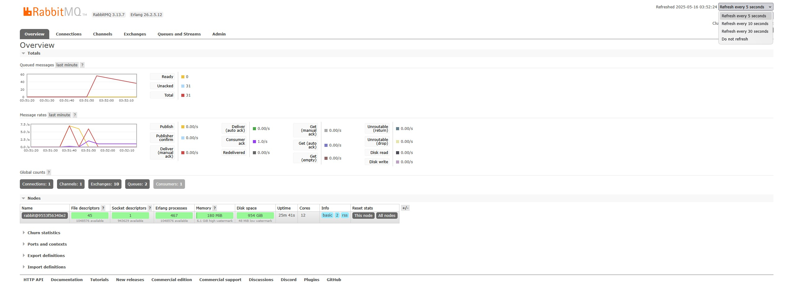
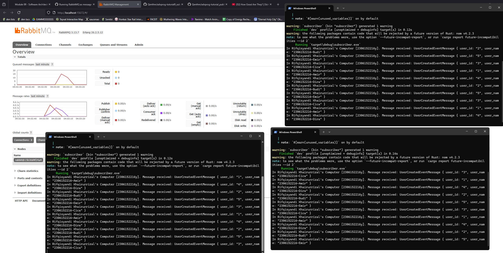

# Reflection

## a. What is AMQP?

AMQP stands for **Advanced Message Queuing Protocol**. It is an open standard protocol for message-oriented middleware. AMQP enables systems to communicate by sending messages between clients and servers (producers and consumers) in a reliable, platform-agnostic, and language-independent way. It is commonly used in message brokers like RabbitMQ to facilitate asynchronous communication between distributed systems.

## b. What does `guest:guest@localhost:5672` mean?

This is a connection string used to connect to an AMQP broker (like RabbitMQ).

- The **first `guest`** is the username used for authentication.
- The **second `guest`** is the password for that user.
- **`localhost`** refers to the local machine (the AMQP broker is running on the same computer).
- **`5672`** is the default port number for AMQP protocol communication.

So, `guest:guest@localhost:5672` means:  
Connect to an AMQP broker running on your own computer (localhost) at port 5672, using the username `guest` and password `guest`.

---

## Simulation: Slow Subscriber

### Screenshot

### Why is the total number of queues as such?

The total number of queues in RabbitMQ depends on how many queues have been declared by all publishers and subscribers, including any test or default queues. In my machine, the total number of queues is **[replace_with_your_number]**. This number may differ from your machine (which is 20) due to differences in running services, test runs, or leftover queues from previous experiments. Each time a new queue is declared (for example, by running the subscriber or publisher), RabbitMQ creates it if it does not already exist.

---

## Reflection: Why does the message queue drain faster with more subscribers?

When you run multiple subscribers, each one can consume messages from the queue in parallel. This increases the overall throughput of message processing, so the spike in the message queue is reduced much quicker than when only one subscriber is running. In other words, the work is distributed among all active subscribers, allowing the queue to be processed faster.

## Screenshot:

### Code Reflection & Possible Improvements

- **Subscriber:** The current subscriber sleeps for 1 second for each message, simulating a slow consumer. If you want to improve throughput, you can reduce the sleep time or optimize the message handling logic.
- **Publisher:** If the publisher sends messages faster than subscribers can process, the queue will grow. Consider implementing rate limiting or batching in the publisher if needed.
- **Scalability:** Running more subscriber instances is a simple and effective way to scale out message processing. However, ensure that your message handler is stateless or properly synchronized if needed.
- **Error Handling:** Add better error handling and logging for production use.

**In summary:**  
Running at least three subscribers allows the queue to be drained faster because messages are processed in parallel. This demonstrates the scalability and flexibility of message queue systems like RabbitMQ.

---

